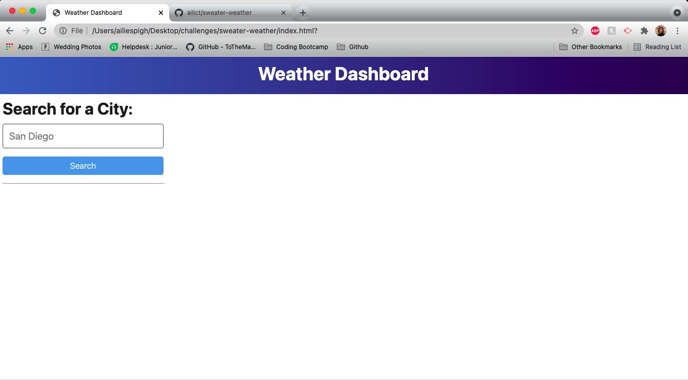

# sweater-weather
This is a simple weather application, that allows users to search for a city and return a 5-day weather forecast. 

This application is built using HTML, CSS, Javascript, and uses the [OpenWeather One Call API](https://openweathermap.org/api/one-call-api). 

Link to [github repository](https://github.com/ailict/sweater-weather) and [deployed application](https://ailict.github.io/sweater-weather/).

Application features: 
User should be able to search current weather conditions for input city, be presented with the city name, the date, an icon representation of weather conditions, the temperature, the humidity, the wind speed, and the UV index (that indicates whether the conditions are favorable, moderate, or severe). 

User should also be presented with a 5-day forecast that displays the date, an icon r
representation of weather conditions, the temperature, the wind speed, and the humidity.

User should be able to click on a city in the search history and again presented with current and future conditions for that city. 

Mockup

Current Model

